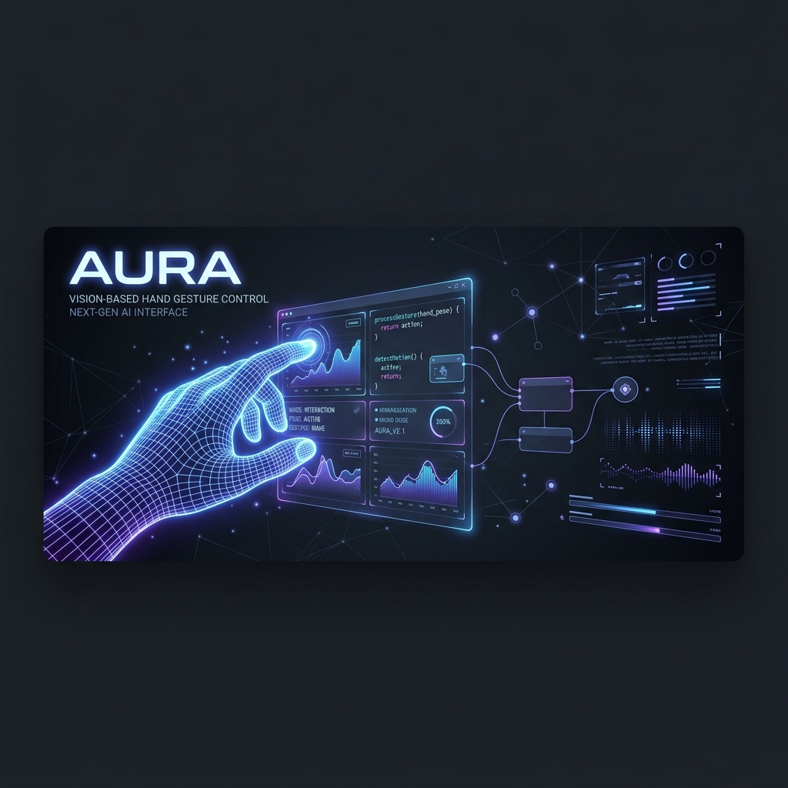

<div align="center">
  
  <br />
  <h1>AURA — AI-powered User-hand Recognition & Automation</h1>
  <p><b>Vision-Based Hand Gesture Control System for Windows — no extra hardware, just a webcam.</b></p>
  
  [](#)
  [](#)
  [](#)
</div>

---

## 🌟 What is AURA?

AURA is a real-time hand gesture system that fully replaces your computer mouse using only a standard webcam and Google's MediaPipe hand tracking AI. By translating specific hand poses into cursor movements and clicks, it enables precise touchless interaction across your entire Windows desktop. AURA tracks your palm centroid instead of fingertips to ensure jitter-free control, making it a reliable solution for daily hands-free usage.

---

## ✨ Features (Interactive Guide)
<details>
<summary><b>🖱️ Core Navigation (Click to expand)</b></summary>

- **Smooth Cursor Control**: Move the cursor seamlessly with a two-finger "peace sign" (index + middle fingers extended).
- **Precision Drop-Finger Clicks**: Drop your index finger for left-click, or drop your middle finger for right-click. The cursor freezes instantly to prevent aim drift.
- **Double Click**: Extend your thumb while holding the peace sign.
- **Drag & Drop**: Make a fist (all fingers down) to start dragging with relative, stable tracking. Release by returning to a peace sign.

</details>

<details>
<summary><b>📜 Scrolling & Zooming (Click to expand)</b></summary>

- **Position-Based Joystick Scroll**: Raise three fingers (index, middle, ring) and move your hand up/down to scroll.
- **Position-Based Joystick Zoom**: Open your entire hand (all fingers extended) and move it up/down to zoom in/out.

</details>

<details>
<summary><b>⚙️ System & Utilities (Click to expand)</b></summary>

- **Volume Control**: Raise your ring finger only and move your hand up/down to adjust system volume.
- **Clutch / Recenter**: Raise your pinky only to pause cursor tracking, allowing you to reposition your hand comfortably.
- **Full Lock**: Raise your ring finger only to completely lock and pause the system.
- **Voice Typing Toggle**: Extend your pinky and thumb to toggle the Windows Voice Typing feature (`Win+H`) for hands-free text input.

</details>

---

## 🛠️ Tech Stack & Architecture

<details>
<summary><b>View Technologies & Frameworks</b></summary>
AURA is built entirely in Python using the following core libraries:

- **Python**: Core application language.
- **MediaPipe**: Google's AI framework for robust real-time hand landmark detection.
- **OpenCV (cv2)**: High-performance webcam capture, image flipping, and overlay rendering.
- **NumPy**: Efficient vector math for computing distances, angles, and One Euro filtering.
- **Pynput**: Operating system-level keyboard simulation.
- **Pywin32**: Direct Windows API calls for zero-latency absolute cursor positioning and mouse events.

</details>

<details>
<summary><b>View System Architecture</b></summary>
AURA relies on a highly responsive, parallel three-process pipeline to ensure smooth, zero-latency performance:

1. **Camera Process**: Captures webcam frames at 30 FPS, flips them, timestamps them precisely at capture time, and pushes them to a shared queue.
2. **MediaPipe Process**: Reads the latest frame, runs the MediaPipe Hand Landmarker model to extract 21 3D hand landmarks, and forwards the results.
3. **Controller Process**: Applies a custom One Euro Filter to smooth coordinates, processes the landmarks through a Finite State Machine (FSM), and issues direct Windows API commands to control the cursor and fire actions.

Communication between these processes happens via non-blocking `multiprocessing.Queue(maxsize=1)` buffers, ensuring that the system always works with the freshest frame and never processes stale data.
</details>

---

## 🚀 Getting Started

```bash
git clone https://github.com/RDPURNO26/AURA
cd AURA
pip install -r requirements.txt
python main.py
```

> **✅ Ready to Use:** The `hand_landmarker.task` AI model file is already included in this repository. Once you clone and install the requirements, you can run the system immediately!

---

## 🖐️ Quick Gesture Reference

| Gesture | Fingers | Action |
| :--- | :---: | :--- |
| **Fist** | 0 (All down) | Drag & Drop |
| **Index only** | 1 (Index up) | Right Click |
| **Middle only** | 1 (Middle up) | Left Click |
| **Ring only** | 1 (Ring up) | Lock (Full pause) |
| **Pinky only** | 1 (Pinky up) | Clutch (Recenter hand) |
| **Pinky + Thumb** | 2 (Pinky, Thumb up) | Toggle Voice Typing |
| **Peace sign** | 2 (Index, Middle up) | Move Cursor |
| **Peace + Thumb** | 3 (Index, Middle, Thumb up) | Double Click |
| **Three fingers** | 3 (Index, Middle, Ring up) | Scroll (Joystick style) |
| **Open hand** | 4+ (All fingers up) | Zoom (Joystick style) |

---

## 📁 Project Structure

<details>
<summary><b>Click to explore files</b></summary>

- `main.py`: Main Entry Point — Connects all three processes and launches the system.
- `camera_process.py`: Camera Capture Process — Captures webcam frames.
- `mediapipe_process.py`: MediaPipe Hand Tracking Process (Tasks API).
- `controller_process.py`: Controller — Handles cursor mapping, One Euro filtering, input dispatch, and screen overlay.
- `gesture_fsm.py`: Two-finger control system — Maintains the 8-state finite state machine.
- `CONTROLS_GUIDE.txt`: Quick reference text document outlining all gestures and rules.
- `MANUAL.md`: Technical user manual detailing calibration, architecture, and troubleshooting.
- `PROJECT_REPORT.md`: Comprehensive project report explaining the design, rationale, and underlying mechanics.

</details>

---

## 🔧 Troubleshooting

| Issue | What to try |
|-------|-------------|
| **MediaPipe exits immediately** | Ensure `hand_landmarker.task` is present in the project root folder. |
| **Clicks too sensitive** | The adaptive threshold handles this automatically. If it persists, hold your hand still for the first 2 seconds of use for clean calibration. |
| **Cursor wrong after clutch** | Hold pinky-only to clutch, recenter, then extend index clearly up for 4 frames. |
| **LOCKED exits too fast** | Make sure to close all fingers into a fist. Opening requires 2+ fingers clearly extended. |

---

<div align="center">
  <b>Built with ❤️ by RD Purno</b><br/>
  <i>Licensed under MIT</i>
</div>
